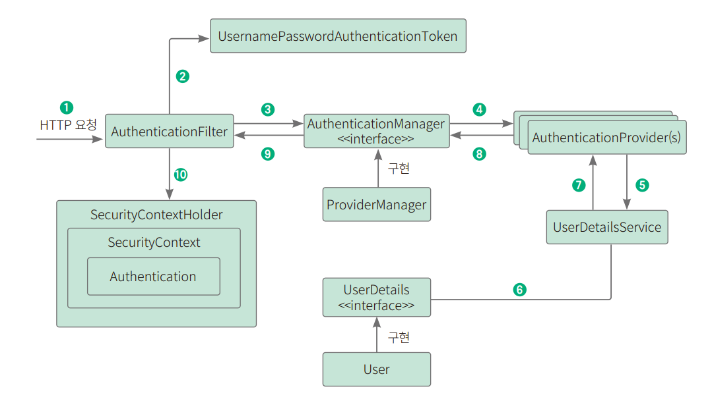

ch08. 스프링 시큐리티로 로그인 / 로그아웃, 회원가입 구현하기
--------------------------------
## 1. 사전 지식 : 스프링 시큐리티
* <b>스프링 시큐리티</b>
  * 스프링 기반의 애플리케이션 보안(인증, 인가, 권한)을 담당하는 하위 프레임워크
    * 인증(authentication) : 사용자의 신원을 입증하는 과정 ex) 로그인시 누구인지 확인
    * 인가(authorization) : 사이트의 특정 부분에 접근할 수 있는지 권한을 확인하는 작업 ex) 관리자 페이지 접근 권한 확인
  * 보안 관련 옵션을 많이 제공
  * 애너테이션 설정 쉬움
  * CSRF 공격, 세션 공격 방어, 요청헤더 보안처리 해줌.
    * CSRF 공격 : 사용자의 권한을 가지고 특정 동작을 수행하도록 유도하는 공격
    * 세션 고정 공격 : 사용자의 인증 정보를 탈취하거나 변조하는 공격 
      
    
* <b>필터 기반으로 동작하는 스프링 시큐리티</b>
  * 스프링 시큐리티는 다양한 필터들로 나누어져 있고, 각 필터에서 인증, 인가와 관련된 작업을 처리함
    
  * 중요 필터
    * UsernamePasswordAuthenticationFilter
      * 아이디와 패스워드가 넘어오면 인증 요청을 위임하는 인증 관리자 역할
    * FilterSecurityInterceptor
      * 권한 부여 처리를 위임해 접든 제어 결정을 쉽게하는 접근 결정 관리자 역할
    * 로그인시 인증 처리 절차
      
      1) 입력 -> HTTPServletRequest에 ID, PW 정보 전달됨 / 이떄 AuthenticationFilter가 유효성 검사함.
      2) 검사 끝나면 실제 구현체인 UsernamePasswordAuthenticationToken을 만들어 넘겨줌
      3) 이 인증용 객체(UsernamePasswordAuthenticationToken을)를 AuthenticationManager에게 보냄
      4) UsernamePasswordAuthenticationToken을 AuthenticationProvider에 보냄.
      
      5) 사용자 아이디를 UserDetailService에 보내면 Id로 찾은 정보를 UserDetails 객체로 만들어 AuthenticationProvider에세 전달함
      6) DB에 있는 사용자 정보 가져옴
      7) 입력 정보와 UserDetaild의 정보 비교해 실제 인증 처리함
      8) 8~10 인증 완료되면 securityContextHolder에 Authentication 저장. 성공 여부에 따라 AuthenticationSuccessHandler, AuthenticationFailureHandler 핸들러 실행

--------------------------------------------------------

## 2. 회원 도메인 만들기
* 실제 구현 : 회원정보 테이블 생성 -> 도메인 생성 -> 회원 엔티티 생성 -> 데이터 조회위한 리포지토리 생성 -> 스프링 시큐리티에서 사용자 정보 가져오는 서비스 생성

### 1) 의존성 추가하기  
(1) 의존성 추가
  * 스프링 시큐리티 사용위해 build.gradle 파일에 의존성 추가

### 2) 엔티티 만들기  
(1) User.java 생성
* 인증 객체
* UserDetails 클래스는 스프링 시큐리티에서 사용자의 인증 정보를 담아두는 인터페이스
* 스프링 시큐리티가 해당 객체를 통해 인증정보를 가져오려면 필수 오버라이드 메서드 여러개 사용해야 함

### 3) 리포지토리 만들기
(1) Repository 생성
* User 엔티티에 대한 리포지토리 생성 (UserRepository.java)
  * 이메일로 사용자 식별하도록 함

### 4) 서비스 메서드 코드 작성하기
(1) 사용자의 정보 가져오는 서비스 코드 작성
* UserDetailsService.java
* 필수로 구현해야하는 loadUserByname() 메서드를 오버라이딩해서 사용자 정보 가져오는 로직 작성

---------------------------------------------------------

## 3. 시큐리티 설정하기
### (1) 실제 인증처리하는 설정 파일 생성
* WebSecurityConfig.java
1) 정적리소스만 스프링 시큐리티 사용 비활성화
2) 특정 HTTP 요청에 개한 웹 기반 보안 구성 - 로그인, 로그아웃 관련 설정
3) 폼 기반 로그인 설정
4) 로그아웃 설정 
5) 5)실습의 편리를 위해 csrf 설정 비활성화 
6) 인증 관리자 관련 설정
7) 사용자 서비스 설정
8) 패스워드 인토더를 빈으로 등록

---------------------------------------------------------

## 4. 회원가입 구현하기
### (1) 서비스 메소드 코드 작성
1) 사용자 정보 답고 있는 객체 생성
   * AddUserRequest.java 파일 추가 
2) 회원 정보 추가 메서드 작성
   * UserService.java 생성
   * 패스워드 암호화해서 저장

### (2) 컨트롤러 작성
* 로그인 페이지를 이동하는 signup() 메서드 작성
1) UserApiController.java 파일 생성
   * 회원 가입 처리 후 로그인 페이지로 이동 위해 리다이렉트
   * 
---------------------------------------------------------

## 5. 회원 가입, 로그인 뷰 작성하기
* 로그인, 회원가입 화면 연결해주는 컨트롤러 생성

### (1) 뷰 컨트롤러 구현
  * 뷰 파일 연결 컨트롤러
  * UserViewController
  * 각각의 경로로 접근 시 각 html 파일 반환하도록 설정

### (2) 뷰 작성 
  * login.html
  * signup.html

---------------------------------------------------------

## 6. 로그아웃 구현하기
### (1) 로그아웃 메서드 추가
* UserApiController에 logout() 메서드 추가
* /logout GET 요청 시 로그아웃 담당 핸들러인 SecurityContextLogoutHandler의 logout() 호출해 로그아웃

### (2) 로그아웃 뷰 추가
* articleList.html 열어서 로그아웃 버튼 추가 

---------------------------------------------------------

## 7. 실행 테스트하기
### (1) 테스트위한 환경 변수 추가
* application.yml에 환경변수 추가

### (2) 로그인, 회원 가입 실행 테스트하기
  1) 서버 실행하고 http://localhost:8080/articles 접근. 인증된 사용자만 접근할 수 있으므로 로그인 페이지로 리다이렉트됨
  2) 회원가입 버튼 또는 http://localhost:8080/signup 입력하여 이동 & 진핸
  3) 회원가입 후 로그인하면 글 목록 페이지로 이동함
  4) 실제로 회원가입한 데이터가 DB에 있는지 확인
  5) users 테이블 확인 쿼리 작성해 조회

### (3) 로그아웃 실행 테스트
  1) 로그아웃 버튼 또는 /logout으로 이동해 확인

---------------------------------------------------------

## 8장 정리
- 스프링 시큐리티에서 가장 기본적으로 제공되는 폼 로그인 방식 구현
