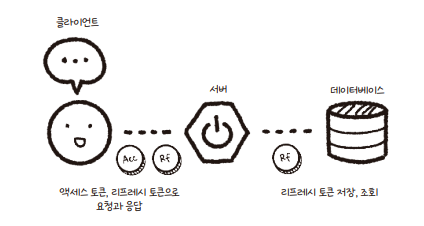
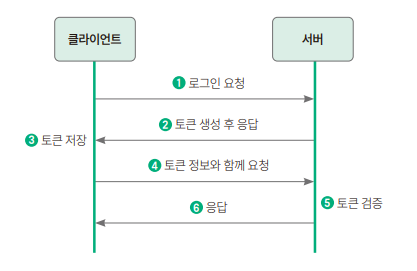
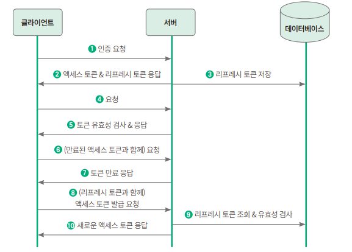
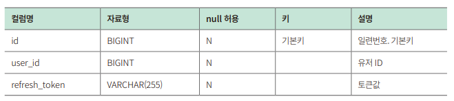
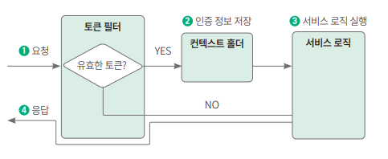

ch09. JWT로 로그인/로그아웃 구현하기
--------------------------------
## 1. 사전 지식 : 토큰 기반 인증

### 1) 토큰 기반 인증이란?
* 사용자 서버 접근 시 인증 된 사용자인지 확인하는 대표적인 방법 2가지
  * <b>서버 기반 인증</b> - 스프링 시큐리티에서 기본 제공 (8장 참고)
  * <b>토큰 기반 인증</b> - 클라이언트를 구분하기 위해 유일한 값인 토큰 사용
    * 서버가 토큰을 생성해서 클라이언트에게 제공하면, 클라이언트는 이 토큰과 함께 여러 요청, 
      서버는 토큰만 보고 유효한 사용자인지 검증
* <b>토큰 전달하고 인증받는 과정</b>
  
* <b>토큰 기반 인증의 특징</b>
  * 무상태성 : 토큰이 클라이언트에 있으므로 서버는 인증 정보를 저장&유지할 필요 없음
  * 확장성 : 각각 API에서 인증해야하는 세션 기반 인증과 달리, 
            토큰이 클라이언트에 있어 하나의 토큰으로 서로 다른 서버에 요청 가능 
            & 로그인 방식 확장 가능 & 다른 서비스에 권한 공유 가능
  * 무결성 : 토큰 발급이후 정보 변경 불가

### 2) JWT란?
* : 토큰 기반 인증에서 주로 사용하는 토큰으로 JSON 형식으로 사용자 정보 저장
* 발급받은 JWT를 이용해 인증하려면 HTTP 요청 헤더 중에 Authorization 키값에 Bearer + JWT 토큰 값 넣어 보내야 함
* <b>헤더, 내용, 서명 구조 (헤더 . 내용 . 서명)</b>
  * 헤더 : 토큰의 타입(type)과 해싱 알고리즘 지정 정보(alg) 포함 
  * 내용 : 토큰에 담을 정보- 내용 한 덩어리 = 클레임
    * 등록된 클레임 : 토큰에 대한 정보 (이름 정해져 있음)
    * 공개 클레임 : 공개되어도 상관없는 클레임 (URL로 지음)
    * 비공개 클레임 : 공개되면 안되는 클레임 (위에 두 클레임이 아닌)
  * 서명 : 조작,변경되지 않았음을 확인하는 용도 - 해시값 생성해 사용
* <b>토큰 유효기간</b>
  * 토큰 탈취 시 확인할 방법X => 유효기간을 설정하자! => 리프레시 토큰 등장
  * 리프레시 토큰 : 액세스 토큰 만료시 새로운 액세스 토큰 발급하기위해 사용
    

---------------------------------------------------------

## 2. JWT 서비스 구현하기
* 의존성과 토큰 제공자 추가 -> 토큰 도메인과 토큰 필터 구현 
* 그러면 JWT 서비스 사용 준비된 것

### (1) 의존성 추가
* build.gradle에 의존성 추가
  * 자바 JWT 라이브러리 추가
  * XML 문서와 자바 객체 간 매핑을 자동화하는 jax-api 추가 
  
### (2) 토큰 제공자 추가
jwt 사용해 jwt 생성 & 유효한 토큰인지 검증하는 클래스 추가  
  1) 설정 파일 수정 (application.yml) 
     * issuer(이슈 발급자), secret_key(비밀키) 필수로 설정해야 함
  2) JwtProperties 클래스 생성
     * 해당 값들을 변수로 접근하는데 사용
  3) TokenProvider.java 파일 생성
     * 토큰 생성 & 유효성 검사 & 토큰에 필요한 정보 가져오는 클래스 
     * 토큰 생성 메서드 : 헤더, 내용, 서명 등등 여러 값 지정
     * JWT 토큰 유효성 검증 메서드 :  복호화 진헹해 F/T 반환
     * 토큰 기반으로 인증 정보를 가져오는 메서드 
     * 토큰 기반으로 유저 ID를 가져오는 메서드 
  4) 테스트 코드 작성
     * config.jwt > JwtFactory.java 생성
     * 빌더 패턴 사용
  5) TokenProviderTest.java 생성
     * generateToken() 메서드 테스트
     * validToken_invalidToken() 메서드 테스트
     * validToken_validToken 테스트
     * getAuthentication() 테스트
     * 테스트 실행
       * 테스트 시 오류 발생 & 해결
         * 오류: error: cannot find symbol return JwtFactory.builder().build();
         * 해결방안: build.gradle 파일 dependencies 에 다음 코드 추가
           * annotationProcessor('org.projectlombok:lombok')
           testAnnotationProcessor('org.projectlombok:lombok')

### (3) 리프레시 토큰 도메인 구현하기
* 테이블 구조
  
1) 도메인 추가 RefreshToken.java
2) 리포지토리 생성 RefreshTokenRepository.java

### (4) 토큰 필터 구현하기
* 각종 요청 처리 위한 로직으로 전달 전후에 URL 패턴에 맞는 모든 요청을 처리하는 기능 제공
* 요청이 오면 헤더 값을 비교해서 토큰이 있는지 확인하고 유효한 토큰이라면 시큐리티 컨텍스트 홀더에 인증정보 저장
    
    * security context : 인증 객체가 저장되는 보관소
    * security context holder : 시큐리티 컨텍스트 객체를 저장하는 객체
1) TokenAuthenticationFilter 생성
   * 액세스 토큰 값이 담기 Authorization 헤더 값을 가져온 뒤 액세스 토큰이 유효하면 인증 정보 설정

---------------------------------------------------------

## 3. 토큰 API 구현하기 
* 리프레시 토큰 받아 검증하고, 유효하며 새로운 액세스 토큰을 생성하는 토큰 API 구현

### (1) 토큰 서비스 추가
  1) UserService 파일에 findById() 메서드 추가
  2) RefreshTokenService 생성
     - 전달받은 리프레시 토큰으로 리프레시 토큰 객체 검색해서 전달하는 findByRefreshToken() 구현
  3) 토큰 서비스 클래스 생성
     * TokenService.java 생성
       * createNewAccessToken() 메서드 : 전달받은 토큰으로 유효성 검사하고, 유효하면 리프레시 토큰으로 사용자 ID 찾음,
                                        마지막으로 토큰 제공자의 generateToken() 호출해서 새로운 액세스 토큰 생성
### (2) 토큰 컨트롤러 추가
  1) dto 생성
     * CreateAccessTokenRequest 생성
     * CreateAccessTokenResponse 생성
  2) TokenApiController 생성
     * POST 요청 들어오면 토큰 서비스에서 리프레시 토큰을 기반으로 새로운 액세스 토큰을 만들어줌
  3) test 파일 작성 :TokenApiControllerTest
  
---------------------------------------------------------

## 9장 키워드
   * 토큰 기반 인증
   * JWT
   * 액세스 토큰
   * 리프레시 토큰
   * 필터
   * 시큐리티 컨텍스트 / 시큐리티 컨텍스트 홀더