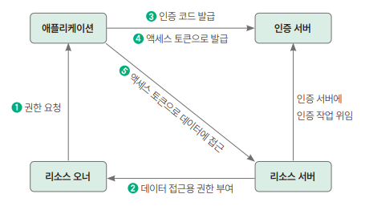

ch10. OAuth2로 로그인/로그아웃 구현하기
--------------------------------
## 1. 사전 지식 : OAuth

### 1) OAuth란?
* 제3의 서비스에 계정관리를 맡기는 방식 (네이버 로그인, 구글 로그인 ...)
* 용어
  * 리소스 오너  : 자신의 정보를 사용하도록 인증 서버에 허가하는 주체 (서비스 사용자)
  * 리소스 서버 : 리소스 오너 정보 가지며, 그 정보를 보호하는 주체 (네이버, 구글, 카카오...)
  * 인증 서버 : 클라이언트에게 리소스 오너의 정보에 접근할 수 있는 토큰을 발급하는 역할을 하는 애플리케이션
  * 클라이언트 애플리케이션 : 인증 서버에게 인증을 받고 리소스 오너의 리소스를 사용하는 주체 (지금 만들고 있는 서비스가 해당)
* 리소스 오너 정보를 취득하는 4가지 방법
  * <b>권한 부여 코드 승인 타입</b> : 가장 유명
  * 암시적 승인 타입
  * 리소스 소유자 암호 자격증명 승인 타입
  * 클라이언트 자격증명 승인 타입
  
### 2) 권한 부여 승인 타입이란?

* 권한 요청
  * 클라이언트(스프링 부트 서버)가 특정 사용자 데이터에 접근하기 위해 권한 서버(카카오, 구글)에 요청을 보내는 것.
    * 요청 URI는 권한 서버마다 다르지만 보통, 클라이언트 ID, 리다이렉트 URI, 응답파일 등을 파라키터로 보냄
      * GET {URI ~} /authorize? clirent_id = __ & redirect_uri = __ & response_type= __ & scope=__ 
* 데이터 접근용 권한 부여
  * 처음 요청 보내는 경우 보이는 페이지를 로그인 페이지로 변경하고 접근 동의 얻음 (최초 1회만)
  * 이후에는 동의 내용 저장하고 있으므로 로그인만 진행됨
  * 로그인 성공시 데이터 접근 인증 및 권한 부여 수신
* 인증 코드 제공
  * 리다이렉트 될 때, 파라미터에 인증 코드 함께 제공
* 액세스 토큰 응답
  * 인증 코드 받으면 액세스 토큰으로 교환해야 함
  * 액세스 토큰 : 로그인 세션에 대한 보안 자격을 증명하는 식별코드를 의미. /token POST 요청
  * client_service : OAtuh 서비스에 등록 때 받은 비밀키
  * grant_type : 권한 유형 확인 
* 액세스 토큰으로 API응답 & 반환
  * 이미 제공받은 액세스 토큰으로 리소스 오너 정보 가져올 수 있음
  * 정보 필요시 API 호출해 정보 가져오고 리소스 서버는 토큰이 유효한지 검사한 뒤 응답

### 3) 쿠키란?
* 웹사이트 서버에서 사용자 방문시 사용자 로컬에 저장하는 작은 데이터
* 키와 값으로 구성
* HTTP 요청을 통해 쿠키의 특정 키에 값을 추가 할 수 있음
* 재방문시 이 쿠키와 함께 서버에 요청

---------------------------------------------------------

## 2. 토큰 발급받기
* 구글 로그인 기능 추가위해서 인증 서버에 토큰을 받아야 함

### 1단계
    * 구글 클라우드 콘솔 접속
### 2단계
    * 콘솔 > 프로젝트 > 새 프로젝트 선택해 만들기
    * 새 프로젝트로 이동
### 3단계
    * 메뉴 > API 및 서비스 - > 사용자 인증 정보 페이지로 이동
### 4단계
    * [동의 화면 구성] 버튼 누르고 User Type을 외부용으로 선택 -> 만들기 클릭
### 5단계
    * 값 입력 화면 나타남
    * 앱 이름 입력 후 이메일, 개발자 연락처 입력 -> 저장 후 계속 클릭
### 6단계
    * 범위 설정 화면
    * 범위 추가 또는 삭제  > openid와 이메일 주소 추가 > 업데이트 > 저장 후 계속
### 7단계
    * 테스트 사용자는 추가하지 않음
    * 저장 후 계속 > 요약 내용 확인 후 대시보드로 돌아가기 클릭 해 작업 마치기
### 8단계
    * 데시보드 > [사용자 인증 정보 >사용자 인증 정보 만들기 > OAuth 클라이언트 ID] 클릭
### 9단계
    * 애플리케이션 유형 - 웹 애플리케이션, 이름 - springboot-developer,
        승인된 리디렉션 URI -  http://localhost:8080/login/oauth2/code.google 입력한뒤 [만들기]
    * 그 뒤에 나오는 클라이언트 ID와 클라이언트 보안 비밀번호는 애플리케이션에서 따로 사용하는 값이므로 따로 메모
    * 생성된 OAuth 인증증 값을 추후에 리소스 오너의 정보에 접근할 떄 사용함
### 10단계
    * OAuth 설정값을 스프링부트 애플리케이션 설정 파일에서 사용하기 위헤 application.yml 파일을 열고 내용 추가
    * 인증값은 깃허브와 같은 외부 사이트에 절대로 업로드하면 안됨!!!

---------------------------------------------------------

## 3. 스프링 시큐리티로 OAuth2 구현하고 적용하기
* 쿠키 관리 클래스 구현 -> OAuth2에서 제공받은 인증 객체로 사용자 정보 가져오는 역할을 하는 서비스 구현
    -> WebSecurityConfig 클래스 대신 사용할  OAuth2 설정 파일 구현

### (1) 의존성 추가하기
#### 1단계 : build.gradle 파일에 의존성 추가

### (2) 쿠키 관리 클래스 구현하기
#### 1단계 : util > CookieUtil.java 파일 셍성
* addCookie : 요청값을 바탕으로 HTTP 응답에 쿠키 추가
* deleteCookie : 쿠키 이름 입력 받아 삭제 -  만료시간을 0으로 설정
* serialize : 객체 직렬화해 쿠키 값으로 들어갈 값으로 변환
* deserialize: 쿠키를 역질렬화 객체로 변환

### (3) OAuth2 서비스 구현하기
* 사용자 정보 조회해 users 테이블에 정보 있으면 리소스 서버에서 제공해주는 이름을 업데이트하고,
  없다면 새로 생성해 DB에 저장하는 서비스 구현
#### 1단계 : domain > Users 에 사용자 이름과 OAuth 관련 키를 저장하는 코드 추가
#### 2단계 : config > oaith > OAuth2UserCustomService 파일 생성
* 리소스 서버에서 보내주는 사용자 정보를 loadUser()을 사용해 불러옴
* users 테이블에 사용자 정보가 있다면 이름 업데이트하고 없다면 saveOrUpdate() 실행해 users 테이블에 회원 데이터 추가

### (4) OAuth2 설정 파일 작성하기
* OAuth2와 JWT를 함께 사용하려면 기존 스프링 시큐리티를 구현하면 작성한 설정이 아니라 다른 설정 사용해야 함.
#### 1단계 : WebSecurityConfig 파일 모두 주석 처리
#### 2단계 : WebOAuthSecurityConfig 파일 생성
* filterChain() : 기존에 사용하던 폼로그인, 세션 비활성화
* addFilterBefore() : 헤더 확인할 커스텀 필터 추가
* authorizeRequests() : 토큰 재발급 URL은 인증 없이 접근 가능하도록 설정,나머지 API URL은 인증 필요
* authorizationEndpoint() : Authorization 요청과 관련된 상태 저장
* exceptionHandling() : 메서드 예외 처리 설정 /api로 시작하는 URL인 경우 401 Unauthorized 반환
#### 3단계 : 저장소 구현
* config > oauth > OAuth2AuthorizationRequestBasedOnCookieRepository 생성
* 권한 인증 흐름에서 클라이언트의 요청을 유지하는데 사용하는 AuthorizationRequestRepository 클래스 구현
#### 4단계 : 인증 성공시 실행할 핸들러 구현
* UserService 파일 수정
  * BCryptPasswordEncoder 삭제 -> BCryptPasswordEncoder를 생성자 사용해 직접 생성해서 비밀번호 암호화할 수 있게 수정
  * findByEmail() 메서드 추가
#### 5단계 : config > oauth > OAuth2SuccessHandler 파일 생성
    @RequiredArgsConstructor
    @Component
    public class OAuth2SuccessHandler extends SimpleUrlAuthenticationSuccessHandler {
    
        public static final String REFRESH_TOKEN_COOKIE_NAME = "refresh_token";
        public static final Duration REFRESH_TOKEN_DURATION = Duration.ofDays(14);
        public static final Duration ACCESS_TOKEN_DURATION = Duration.ofDays(1);
        public static final String REDIRECT_PATH = "/articles";
    
        private final TokenProvider tokenProvider;
        private final RefreshTokenRepository refreshTokenRepository;
        private final OAuth2AuthorizationRequestBasedOnCookieRepository authorizationRequestRepository;
        private final UserService userService;
    
        @Override
        public void onAuthenticationSuccess(HttpServletRequest request, HttpServletResponse response, Authentication authentication) throws IOException {
            OAuth2User oAuth2User = (OAuth2User) authentication.getPrincipal();
            User user = userService.findByEmail((String) oAuth2User.getAttributes().get("email"));
    
            // 리프레시 토큰 생성 -> 저장 -> 쿠키에 저장
            String refreshToken = tokenProvider.generateToken(user, REFRESH_TOKEN_DURATION);
            saveRefreshToken(user.getId(), refreshToken);
            addRefreshTokenToCookie(request, response, refreshToken);
    
            // 액세스 토큰 생성 -> 패스에 액세스 토큰 추가
            String accessToken = tokenProvider.generateToken(user, ACCESS_TOKEN_DURATION);
            String targetUrl = getTargetUrl(accessToken);
        
            // 인증 관련 설정값, 쿠키 제거
            clearAuthenticationAttributes(request, response);
            
            // 리다이렉트
            getRedirectStrategy().sendRedirect(request, response, targetUrl);
        }
    
        // 생성된 리프레시 토큰을 전달받아 데이터베이스에 저장
        private void saveRefreshToken(Long userId, String newRefreshToken) {
            RefreshToken refreshToken = refreshTokenRepository.findByUserId(userId)
                    .map(entity -> entity.update(newRefreshToken))
                    .orElse(new RefreshToken(userId, newRefreshToken));
    
            refreshTokenRepository.save(refreshToken);
        }
    
        // 생성된 리프레시 토큰을 쿠키에 저장
        private void addRefreshTokenToCookie(HttpServletRequest request, HttpServletResponse response, String refreshToken) {
            int cookieMaxAge = (int) REFRESH_TOKEN_DURATION.toSeconds();
    
            CookieUtil.deleteCookie(request, response, REFRESH_TOKEN_COOKIE_NAME);
            CookieUtil.addCookie(response, REFRESH_TOKEN_COOKIE_NAME, refreshToken, cookieMaxAge);
        }
    
        // 인증 관련 설정값, 쿠키 제거
        private void clearAuthenticationAttributes(HttpServletRequest request, HttpServletResponse response) {
            super.clearAuthenticationAttributes(request);
            authorizationRequestRepository.removeAuthorizationRequestCookies(request, response);
        }
    
        // 액세스 토큰을 패스에 추가
        private String getTargetUrl(String token) {
            return UriComponentsBuilder.fromUriString(REDIRECT_PATH)
                    .queryParam("token", token)
                    .build()
                    .toUriString();
        }
    }

### (5) 글에 글쓴이 추가하기

#### 1단계
* domain > Article 파일에 author 변수 추가 
#### 2단계
* dto > AddArticlerequest 파일에 toEntity()메서드 수정해 author 값도 추가 저장하도록 변경
#### 3단계
* service > BlogService > save() 메서드 수정
#### 4단계
* controller > BlogApiController 파일 > addArticle() 수정
#### 5단계
* dto > ArticleViewResponse 파일 수정 > author 필드 추가
#### 6단계 : 데이터 추가
* 실행할 떄마다 데이터 추가 위해 data.sql > author 파일 추가
#### 7단계 : 뷰 수정
* article.html 수정

### (6) OAuth 뷰 구성하기

#### 1단계 : controller > UserViewController > login() 메서드의 뷰 변경
#### 2단계 : 구글 이미지 다운
#### 3단계 : img 디렉토리 생성
#### 4단계 : img 디렉토리에 저장한 이미지 넣기
#### 5단계 : 이미지 활용해서 연결 버튼 생성
#### 6단계 : html 파일과 연결할 js파일 생성
#### 7단계 : articleList.html 파일 수정
#### 8단계 : article.js 수정
#### 9단계 : article.js 수정

### (7) 글 수정, 삭제 글쓴이 확인 로직 추가하기
* 본인 글이 아닌 경우 수정,삭제 시도시 예외 발생하도록 수정
#### 1단계 : BlogService 파일 수정
* 수정, 삭제 메서드 수정 & 게시글 작성한 유저인지 확인하는 메서드 추가 

---------------------------------------------------------

## 4. OAuth2 실행 테스트하기

* 실행 - 로그인
* 개발자 도구 확인
* 리다이렉트 확인
* 스프링부트 애플리케이션으로부터 전달받은 액세스 토큰 저장한다는 것을 확인할 수 있음
* 리프레시 토큰도 확인
* /new-article로 이동해 글 등록 확인
* 토큰 삭제해보기
* 글등록 하려고 하면 리프레시 토큰이있어 잘 등록됨
* 내가 작성한 글 아닌 글 수정,삭제하려 하면 안되는 것 확인

---------------------------------------------------------

## 5. 테스트 코드 실패 해결하고 코드 수정하기

#### 1단계
* 테스트 코드 작성
#### 2단계
* 테스트 실패
#### 3단계
* BlogApiControllerTest 파일 수정

