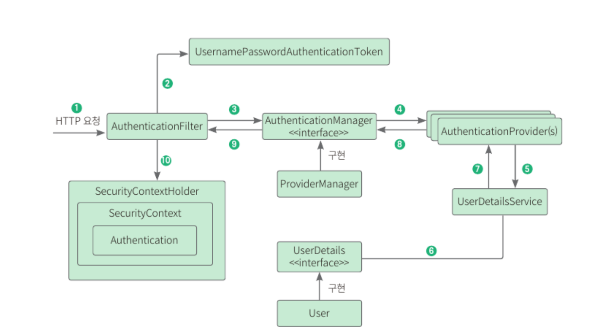

## 8.1 사전 지식: 스프링 시큐리티

#### 인증과 인가
- 인증: 사용자의 신원을 입증하는 과정 
  - ex. 사용자가 사이트에 로그인할 때 누구인지 확인하는 과정
- 인가: 사이트의 특정 부분에 접근할 수 있는지 권한을 확인하는 작업
  - ex. 관리자는 관리자 페이지에 접근 가능하지만 일반 사용자는 접근 불가

#### 스프링 시큐리티
- 스프링 시큐리티: 스프링 기반 애플리케이션의 보안을 담당하는 스프링 하위 프레임워크
- CSRF 공격, 세션 고정 공격을 방어해주고 요청 헤더를 보안 처리해주므로 개발자가 보안 관련 개발을 해야 하는 부담을 크게 줄여준다.
  - CSRF 공격: 사용자의 권한을 가지고 특정 동작을 수행하도록 유도하는 공격
  - 세션 고정 공격: 사용자의 인증 정보를 탈취하거나 변조하는 공격

#### 필터 기반으로 동작하는 스프링 시큐리티


- 동작 원리
  - _SecurityContextPersistenceFilter_ 부터 시작해 _FilterSecurityInterceptor_ 까지 순서대로 필터를 거친다.
  - 필터를 실행할 때는 회색 화살표로 연결된 오른쪽 박스의 클래스를 거치며 실행된다.
- 특정 필터를 제거하거나 커스텀 필터를 넣는 등의 설정도 가능

| 필터명                                    | 설명                                                                                                                                          |
|----------------------------------------|---------------------------------------------------------------------------------------------------------------------------------------------|
| SecurityContextPersistenceFilter       | SecurityContextRepository에서 SecurityContext(접근 주체와 인증에 대한 정보를 담는 객체)를 가져오거나 저장하는 역할                                                         |
| LogoutFilter                           | 설정된 로그아웃 URL로 오는 요청을 확인해 해당 사용자를 로그아웃 처리                                                                                                    |
| UsernamePasswordAuthenticationFilter   | 인증 관리자. 폼 기반 로그인을 할 때 사용되는 필터로 아이디, 패스워드 데이터를 파싱해 인증 요청을 위임함. 인증이 성공하면 AuthenticationSuccessHandler를, 실패하면 AuthenticationFailureHandler를 실행 |
| DefaultLoginPageGeneratingFilter       | 사용자가 로그인 페이지를 따로 지정하지 않았을 때 기본으로 설정하는 로그인 페이지 관련 필터                                                                                         |
| BasicAuthenticationFilter              | 요청 헤더에 있는 아이디와 패스워드를 파싱해 인증 요청을 위임함. 인증이 성공하면 AuthenticaitonSuccessHandler를, 실패하면 AuthenticationFailureHandler를 실행                          |
| RequestCacheAwareFilter                | 로그인 성공 후 관련 있는 캐시 요청이 있는지 확인하고 캐시 요청을 처리해줌. 예를 들어 로그인하지 않은 상태로 방문했던 페이지를 기억해두었다가 로그인 이후 그 페이지로 이동시켜줌                                        |
| SecurityContextHolderAwareRequestFilter | HttpServletRequest 정보를 감쌈. 필터 체인 상의 다음 필터들에게 부가 정보를 제공되기 위해 사용                                                                              |
| AnonymousAuthenticationFilter          | 필터가 호출되는 시점까지 인증되지 않았다면 익명 사용자 전용 객체인 AnonymousAuthentication을 만들어 SecurityContext에 넣어줌                                                     |
| SessionManagementFilter                | 인증된 사용자와 관련된 세션 관련 작업 진행. 세션 변조 방지 전략을 설정하고 유효하지 않은 세션에 대한 처리, 세션 생성 전략을 세우는 등의 작업 처리                                                       |
| ExceptionTranslationFilter             | 요청을 처리하는 중 발생할 수 있는 예외를 위임하거나 전달                                                                                                            |
| FilterSecurityInterceptor              | 접근 결정 관리자. AccessDecisionManager로 권한 부여 처리를 위임함으로써 접근 제어 결정을 쉽게 해줌. 인가 관련 설정 가능                                                             |
<br>

- 폼 로그인 시 스프링 시큐리티의 인증 처리 절차 


1. 사용자가 폼에 아이디/패스워드 입력 → HTTPServletRequest에 아이디/패스워드 정보가 전달됨. 이때 AuthenticationFilter가 넘어온 아이디와 패스워드의 유효성 검사 진행
2. 유효성 검사가 끝나면 실제 구현체인 UsernamePasswordAuthenticationToken을 만들어 넘겨줌
3. 전달받은 인증용 객체인 UsernamaPasswordAuthenticationToken을 AuthenticationManager에게 보냄
4. UsernamePasswordAuthenticationToken을 AuthenticationProvider에게 보냄
5. 사용자 아이디를 UserDetailService에게 보냄. UserDetailService는 전달받은 아이디로 찾은 사용자의 정볼르 UserDetails 객체로 만들어 AuthenticationProvider에게 전달
6. DB에 있는 사용자 정보를 가져옴 
7. 입력 정보와 UserDetails 정보를 비교해 실제 인증 처리 진행
8. 8-10 까지 인증이 완료되면 SecurityContextHolder에 Authentication 저장. 인증 성공 여부에 따라 각 핸들러 실행

## 8.2 회원 도메인 만들기

### 8.2.1 의존성 추가 
- 스프링 시큐리티를 사용하기 위한 의존성 추가
  - 스프링 시큐리티를 사용하기 위한 스타터
  - 타임리프에서 스프링 시큐리티를 사용하기 위한 의존성
  - 스프링 시큐리티를 테스트하기 위한 의존성

## 8.2.2 엔티티 만들기
- **UserDetails 클래스를 상속하는 User 클래스** 생성 → 인증 객체로 사용
- 스프링 시큐리티에서 해당 객체를 통해 인증 정보를 가져오기 위해서 필수로 오버라이딩 해야하는 메서드 존재 

### 8.2.3 리포지터리 만들기
- 이메일로 사용자 정보를 가져오는 쿼리 메서드 작성
- 스프링 데이터 JPA는 메서드 규칙에 맞춰 메서드를 선언하면 이름을 분석해 자동으로 쿼리를 생성해준다.
  - `findByName()` → `WHERE name=?`
  - `findByNameAndAge()` → `WHERE name=? AND age=?`
  - `findByNameOrAge()` → `WHERE name=? OR age=?`
  - `findByAgeLessThan()` → `WHERE age<?`
  - `findByAgeGreaterThan()` → `WHERE age>?`
  - `findByName(Is)Null()` → `WHERE name IS NULL`

### 8.2.4 서비스 메서드 코드 작성하기
- **UserDetailsService 를 구현하는 UserDetailService 클래스** 작성
  - UserDetailsService: 스프링 시큐리티에서 사용자 정보를 가져오는 인터페이스
  - 사용자 이름으로 사용자 정보를 가져오는 loadUserByUsername(String username) 메서드를 필수로 오버라이딩 해야함

## 8.3 시큐리티 설정하기

- 스프링 시큐리티 기능 비활성화
  ```java
    @Bean
    public WebSecurityCustomizer configure(){
        return (web) -> web.ignoring()
                .requestMatchers(toH2Console())
                .requestMatchers("/static/**");
    }
  ```
  - 스프링 시큐리티의 모든 기능을 사용하지 않게 설정하는 코드
  - 인증, 인가 서비스를 모든 곳에 적용하지 않음. 정적 리소스의 경우 스프링 시큐리티 사용 비활성화
- 특정 HTTP 요청에 대한 웹 기반 보안 구성
  ```java
  @Bean
      public SecurityFilterChain filterChain(HttpSecurity http) throws Exception{
          return http
                  .authorizeHttpRequests() //인증, 인가 설정
                  .requestMatchers("/login","/signup","/user").permitAll()
                  .anyRequest().authenticated()
                  .and()
                  .formLogin() //폼 기반 로그인 설정
                  .loginPage("/login")
                  .defaultSuccessUrl("/articles")
                  .and()
                  .logout()  //로그아웃 설정
                  .logoutSuccessUrl("/login")
                  .invalidateHttpSession(true)
                  .and()
                  .csrf().disable()  //csrf 비활성화
                  .build();
      }
  ```
  - 인증/인가 및 로그인, 로그아웃 관련 설정을 하는 메서드
  - `authorizeHttpRequests()`: 특정 경로에 대한 액세스 설정. '/login', '/signup', '/user' 로 요청이 오면 인증/인가 없이 접근이 가능하지만 이외의 요청에 대해서는 인증이 성공된 상태여야 접근 가능하도록 설정함
  - `formLogin()`: 폼 기반 로그인 설정. 로그인 경로와 로그인이 완료되었을 떄 이동할 경로 설정
  - `logout()`: 로그아웃 설정. 로그아웃이 완료되었을 때 이동할 경로와 로그아웃 이후 세션을 전체 삭제할지 여부를 설정
  - `csrf().disable()`: CSRF 설정 비활성화. (CSRF 공격 방어를 위해서는 활성화하는 게 좋으나 실습의 편의를 위해 비활성화)

- 인증 관리자 관련 설정
  ```java
  @Bean
      public AuthenticationManager authenticationManager(HttpSecurity http, BCryptPasswordEncoder bCryptPasswordEncoder,UserDetailsService userDetailsService) throws  Exception{
          return http.getSharedObject(AuthenticationManagerBuilder.class)
                  .userDetailsService(userService)  //사용자 정보 서비스 설정
                  .passwordEncoder(bCryptPasswordEncoder)
                  .and()
                  .build();
      }
  ```
  - 사용자 정보를 가져올 서비스를 재정의하거나 인증방법 등을 설정할 때 사용
  - `userDetailsService()`: 사용자 정보를 가져올 서비스 설정
  - `passwordEncoder()`: 비밀번호를 암호화하기 위한 인코더 설정

- 패스워드 인코더를 빈으로 등록
  ```java
  @Bean
      public BCryptPasswordEncoder bCryptPasswordEncoder(){
          return new BCryptPasswordEncoder();
      }
  ```

## 8.4 회원 가입 구현하기

### 8.4.1 서비스 메서드 코드 작성하기
- 회원가입 요청시 사용할 dto 객체 작성
- UserService 서비스 클래스 작성
  - 패스워드를 저장할 때에는 시큐리티 설정 시 패스워드 인코딩 용으로 등록했던 빈을 사용해서 암호화한 후에 저장해야함

### 8.4.2 컨트롤러 작성하기
- 서비스 메서드를 호출해 회원가입 처리 후 로그인 페이지로 리다이렉트하도록 구현

