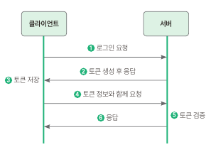
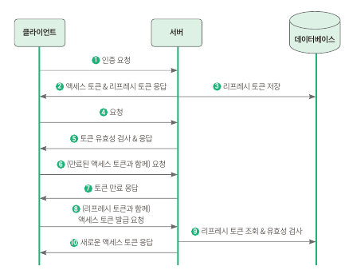
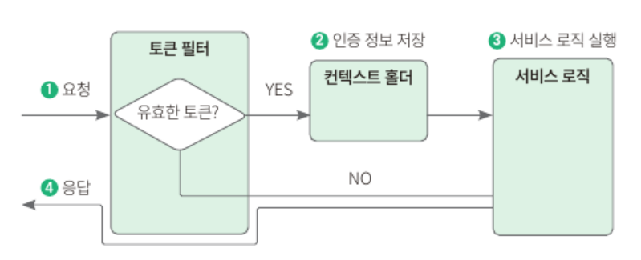

## 9.1 사전 지식: 토큰 기반 인증
### 9.1.1 토큰 기반 인증이란?
- 대표적인 사용자 인증 확인 방법
  - 세션 기반 인증: 사용자마다 사용자의 정보를 담은 세션을 생성하고 저장해서 인증. 8장에서는 스프링 시큐리티에서 기본적으로 제공해주는 세션 기반 인증을 사용했음
  - 토큰 기반 인증: 서버에서 클라이언트를 구분하기 위한 유일한 값인 토큰을 서버가 생성해서 클라이언트에게 제공하면, 클라이언트는 이 토큰을 갖고 있다가 여러 요청을 이 토큰과 함께 신청하는 방식. 서버는 토큰만 보고 유효한 사용자인지 검증한다.
#### 토큰을 전달하고 인증 받는 과정
- 클라이언트와 서버가 토큰을 주고받으며 통신하는 과정
  
  1. 클라이언트가 아이디와 비밀번호를 서버에게 전달하며 인증 요청
  2. 서버는 아이디와 비밀번호를 확인해 유효한 사용자인지 검증 → 유효한 사용자이면 토큰을 생성해 응답
  3. 클라이언트는 서버에서 준 토큰을 저장
  4. 클라이언트는 인증이 필요한 API를 호출할 때마다 토큰을 함께 보냄
  5. 서버는 토큰의 유효성을 검증 → 토큰이 유효하면 요청 처리
#### 토큰 기반 인증의 특징
- **무상태성**
  - 서버 입장에서 클라이언트의 인증 정보를 저장하거나 유지하지 않아도 되기 때문에 완전한 무상태로 효율적인 검증이 가능하다.
- **확장성**
  - 서버를 확장할 때 상태 관리를 신경 쓸 필요가 없으니 서버 확장에 용이하다. 예를 들어, 결제 서버와 주문 서버가 나뉘어져 있을 때 세션 기반 인증의 경우 각각의 API에서 인증을 해야되지만, 토큰 기반 인증에서는 클라이언트가 토큰을 가지고있으므로 하나의 토큰으로 두 서버에 모두 요청을 보낼 수 있다. 
  - 페이스북 로그인, 구글 로그인 과 같이 토큰 기반 인증을 사용하는 다른 시스템에 접근해 로그인 방식 확장 가능, 이를 활용해 다른 서비스에 권한을 공유하는 것도 가능
- **무결성**
  - 토큰을 발급한 이후 토큰 정보를 변경하는 행위가 불가능하다. ⇒ 토큰의 무결성이 보장된다.
### 9.1.2 JWT
- JWT 를 이용한 인증 방법
    HTTP 요청 헤더 중 `Authorization` 키값에 '`Bearer + JWT 토큰 값`'을 넣어 보냄
- JWT의 구조: .을 기준으로 헤더/내용/서명 으로 이루어져 있다.
  - **헤더**: 토큰 타입과 해싱 알고리즘을 지정하는 정보를 담는다.
    - | 이름  | 설명         |
      |-----|------------|
      | typ | 토큰의 타입 지정  |
      | alg | 해싱 알고리즘 지정 |
      ```json
      {
          "typ":"JWT"   
          "alg":"HS256"
      }
      ```
  - **내용**: 토큰과 관련한 정보를 담는다.
    - **클레임(claim)**: 내용의 한 덩어리. 키-값 한 쌍으로 이루어져 있다. 등록된 클레임/공개 클레임/비공개 클레임으로 나눌 수 있다.
    - **등록된 클레임**: 토큰에 대한 정보를 담는 데 사용한다.
      | 이름  | 설명         |
      |-----|------------|
      | iss | 토큰 발급자 (issuer)  |
      | sub | 토큰 제목 (subject) |
      | aud| 토큰 대상자 (audience)|
      |exp|토큰 만료 시간 (expiration)|
      |nbf|토큰의 활성 날짜 (not before)|
      |iat|토큰이 발급된 시간 (issued at)|
      |jti|JWT의 고유 식별자로서 주로 일회용 토큰에 사용|
    - **공개 클레임**: 공개되어도 상관 없는 클레임, 충돌을 방지할 수 있는 이름을 가져야 하며 보통 클레임 이름을 URI로 짓는다.
    - **비공개 클레임**: 공개되면 안 되는 클레임, 클라이언트와 서버 간의 통신에 사용된다.
    - JWT 내용 예시
      ```json
      {
      "iss": "asfkjl@gmail.com",  //등록된 클레임
      "iat": 1622370878,  //등록된 클레임
      "exp": 1622372678,  //등록된 클레임
      "https://shinsunyoung.com/jwt_claims/is_admin": true,  //공개 클레임
      "email": "akdljs@gmail.com",  //비공개 클레임
      "hello": "안녕하세요!"  //비공개 클레임
      ```
  - **서명**: 해당 토큰이 조작되었거나 변경되지 않았음을 확인하는 용도로 사용된다. 
    - 헤더의 인코딩값과 내용의 인코딩값을 합친 후 주어진 비밀키를 사용해 생성한 해시값 사용

#### 토큰 유효기간
만약 토큰이 탈취된다면, 서버는 토큰과 함께 들어온 요청이 토큰을 탈취한 사람의 요청인지 확인할 수 없다.
- 리프레시 토큰 도입 배경
  - 토큰의 유효기간을 짧게 한다면?: 토큰이 탈취되었을 때를 대비 가능하나 정상 사용자 입장에서 불편 ⇒ 리프레시 토큰으로 해결 가능
  - 리프레시 토큰: 사용자를 인증하기 위한 용도인 액세스 토큰이 만료되었을 때 새로운 액세스 토큰을 발급하기 위해 사용
  - 액세스 토큰의 유효기간을 짧게 설정하고, 리프레시 토큰의 유효 기간을 길게 설정하면 공격자가 액세스 토큰을 탈취했을 시 비교적 안전해짐
- 리프레시 토큰과 액세스 토큰을 사용한 통신
  
  1. 클라이언트가 서버에게 인증 요청
  2. 서버는 클라이언트에게서 전달받은 정보를 바탕으로 인증이 유효한지 확인 → 유효하다면 액세스 토큰과 리프레시 토큰을 클라이언트에게 발행, 클라이언트는 전달받은 토큰들을 저장
  3. 서버에서 생성한 리프레시 토큰은 DB에도 저장
  4. 클라이언트는 API 를 호출할 때 저장한 액세스 토큰과 함께 요청
  5. 서버는 전달받은 액세스 토큰의 유효성 검사 → 유효하다면 요청 처리
  6. <액세스 토큰이 만료된 후> 클라이언트가 저장한 액세스 토큰과 함께 API 요청
  7. 서버는 액세스 토큰의 유효성 검사 → 만료된 토큰의 경우 유효하지 않음. 만료됐다는 에러 전달
  8. 클라이언트는 저장해둔 리프레시 토큰과 함께 새로운 액세스 토큰을 발급하는 요청 전송
  9. 서버는 전달받은 리프레시 토큰이 유효한지 DB를 조회
  10. 유효한 리프레시 토큰일 시 새로운 액세스 토큰을 클라이언트에게 발행

## 9.2 JWT 서비스 구현하기

### 9.2.1 의존성 추가
```
    implementation 'io.jsonwebtoken:jjwt:0.9.1' //자바 JWT 라이브러리
    implementation 'javax.xml.bind:jaxb-api:2.3.1'  //XML 문서와 Java 객체 간 매핑 자동화
```

### 9.2.2 토큰 제공자 추가
- issuer 와 secret_key 를 설정 파일에 선언
  ```yaml
    jWt:
      issuer: ajufresh@gmail.com
      secret_key: study-springboot
  ```
- 설정 파일에 선언한 값들을 변수로 접근하는 데 사용할 클래스 작성
  - `@ConfigurationProperties("jwt")` : 자바 클래스에 프로퍼티 값을 가져와 사용하는 어노테이션
- TokenProvider.java
  **- jwt 토큰 생성 메서드**
    ```java
    private String makeToken(Date expiry, User user){
        Date now = new Date();

        return Jwts.builder()
                .setHeaderParam(Header.TYPE, Header.JWT_TYPE)   //헤더 typ : jwt
                .setIssuer(jwtProperties.getIssuer())
                .setIssuedAt(now)
                .setExpiration(expiry)
                .setSubject(user.getEmail())
                .claim("id",user.getId())
                .signWith(SignatureAlgorithm.HS256, jwtProperties.getSecretKey()) //비밀값과 함께 해시값을 HS256 방식으로 암호화
                .compact();
    }
    ```
    만료 시간과 유저 정보를 인자로 받은 후 set 메서드를 통해 여러 값들을 지정. 토큰을 만들 때 properties 파일에 선언해둔 비밀값과 함께 HS256 방식으로 암호화
  **- 토큰 유효성 검사 메서드**
    ```java
        public boolean validToken(String token){
        try{
            Jwts.parser()
                    .setSigningKey(jwtProperties.getSecretKey()) //비밀값으로 복호화
                    .parseClaimsJws(token);
            return true;
        } catch (Exception e){  //복호화 과정에서 에러가 나면 유효하지 않은 토큰임.
            return false;
        }
    }
    ```
    properties 파일에 선언한 비밀값과 함께 토큰 복호화 진행. 복호화 과정에서 에러가 발생하면 false 리턴
  **- 토큰 기반으로 인증 정보를 가져오는 메서드**
    ```java
        public Authentication getAuthentication(String token){
        Claims claims = getClaims(token);
        Set<SimpleGrantedAuthority> authorities = Collections.singleton(new SimpleGrantedAuthority("ROLE_USER"));

        return new UsernamePasswordAuthenticationToken(new org.springframework.security.core.userdetails.User(claims.getSubject(),"",authorities),token,authorities);
    }
    ```
    토큰을 받아 인증 정보를 담은 객체 Authentication을 반환하는 메서드. properties 파일에 저장한 비밀값으로 토큰을 복호화한 뒤 클레임을 가져오는 private 메서드인 getClaims() 를 호출해서 클레임 정보를 반환받는다. 그 이후 사용자 이메일에 들어 있는 토큰 제목 sub와 토큰 기반으로 인증 정보를 생성
  **- 토큰 기반으로 유저 ID를 가져오는 메서드**
    ```java
        public Long getUserId(String token){
        Claims claims = getClaims(token);
        return claims.get("id",Long.class);
    }
    ```
    properties 파일에 저장한 비밀값으로 토큰을 복호화한 다음 클레임을 가져오는 private 메서드인 getClaims() 를 호출해서 클레임 정보를 반환받고 클레임에서 id 키로 저장된 값을 가져와 반환
- 테스트 코드 작성
  - generateToken() 테스트
    ```java
        @DisplayName("generateToken(): 유저 정보와 만료 기간을 전달해 토큰을 만들 수 있다.")
    @Test
    void generateToken(){
        //given
        User testUser = userRepository.save(User.builder()
                .email("user@gmail.com")
                .password("test")
                .build());

        //when
        String token = tokenProvider.generateToken(testUser, Duration.ofDays(14));

        //then
        Long userId = Jwts.parser()
                .setSigningKey(jwtProperties.getSecretKey())
                .parseClaimsJws(token)
                .getBody()
                .get("id",Long.class);

        assertThat(userId).isEqualTo(testUser.getId());
    }
    ```
    - given: 토큰에 유저 정보를 추가하기 위해 테스트 유저 생성
    - when: TokenProvider 의 generateToken() 메서드를 호출해 토큰 생성
    - when: jjwt 라이브러리를 사용해 토큰을 복호화. 토큰을 만들 때 클레임으로 넣어둔 id 값이 given 절에서 만든 유저 id와 일치하는지 확인
  - validToken_invalidToken() 테스트
    ```java
        @DisplayName("validToken(): 만료된 토큰인 때 유효성 검증에 실패한다.")
    @Test
    void validToken_invalidToken(){
        //given
        String token = JwtFactory.builder()
                .expiration(new Date(new Date().getTime() - Duration.ofDays(7).toMillis()))
                .build()
                .createToken(jwtProperties);

        //when
        boolean result = tokenProvider.validToken(token);

        //then
        assertThat(result).isFalse();
    }
    ```
    - given: jjwt 라이브러리를 사용해 토큰 생성. 만료 시간은 1970/1/1 부터 현재 시간을 밀리초 단위;로 치환한 값에서 1000을 뺀 시간으로 설정 → 이미 만료된 토큰으로 생성됨
    - when: TokenProvider 의 validToken() 메서드를 호출해 유효한 토큰인지 검증한 뒤 결괏값 (boolean) 반환
    - when: 반환받은 결괏값이 false (유효한 토큰이 아님) 인 것을 확인
  - getAuthentication() 테스트
    ```java
        @DisplayName("getAuthentication(): 토큰 기반으로 인증 정보를 가져올 수 있다.")
    @Test
    void getAuthentication(){
        //given
        String userEmail = "user@eamil.com";
        String token = JwtFactory.builder()
                .subject(userEmail)
                .build()
                .createToken(jwtProperties);

        //when
        Authentication authentication = tokenProvider.getAuthentication(token);

        //then
        assertThat(((UserDetails) authentication.getPrincipal()).getUsername()).isEqualTo(userEmail);
    }
    ```
    - given: jjwt 라이브러리를 사용해 토큰 생성. 이때 토큰 제목인 subject 는 "user@email.com" 이라는 값 사용
    - when: TokenProvider 의 getAuthentication() 메서드를 호출해 인증 객체를 반환 받음
    - when: 반환받은 인증 객체의 유저 이름을 가져와 given 절에서 설정한 subject 값인 "user@email.com" 과 일치하는지 확인
  - getUserId() 테스트
    ```java
        @DisplayName("getUserId(): 토큰으로 유저 ID를 가져올 수 있다.")
    @Test
    void getUserId(){
        //given
        Long userId = 1L;
        String token = JwtFactory.builder()
                .claims(Map.of("id",userId))
                .build()
                .createToken(jwtProperties);
        //when
        Long userIdByToken = tokenProvider.getUserId(token);
        //then
        assertThat(userIdByToken).isEqualTo(userId);
    }
    ```
    - given: jjwt 라이브러리를 사용해 토큰 생성. 이때 키는 "id" 이고 값은 1인 유저 ID를 담은 클레임 추가
    - when: TokenProvider 의 getUserId() 메서드를 호출해 유저 ID를 반환 받음
    - when: 반환받은 유저 ID가 given 절에서 설정한 유저 ID값인 1과 같은지 확인


### 9.2.3 리프레시 토큰 도메인 구현하기
- 리프레시 토큰은 데이터베이스에 저장하는 정보이므로 엔티티와 리포지터리 추가

### 9.2.4 토큰 필터 구현하기
- 필터: 각종 요청을 처리하기 위한 로직으로 전달되기 전후에 URL 패턴에 맞는 모든 요청을 처리하는 기능 제공
- 토큰 필터
  
  - 요청이 오면 헤더 값을 비교해서 토큰이 있는지 확인하고, 유효한 토큰이라면 security context holder 에 인증 정보를 저장, 서비스 로직 실행
- 시큐리티 컨텍스트 (security context): 인증 객체가 저장되는 보관소
  - 스레드마다 공간을 할당하는 스레드 로컬 (thread local) 에 저장되므로 코드의 아무 곳에서나 참조할 수 있고, 다른 스레드와 공유하지 않으므로 독립적으로 사용 가능
- 시큐리티 컨텍스트 홀더 (security context holder): 시큐리티 컨텍스트 객체를 저장하는 객체


## 9.3 토큰 API 구현하기
- 리프레시 토큰을 전달받아 검증하고, 유효하다면 새로운 액세스 토큰을 생성하는 토큰 API 구현
### 9.3.1 토큰 서비스 추가하기
- UserService: 유저 ID를 인자로 전달 받아 유저를 검색 후 전달하는 메서드 작성
- RefreshTokenService: 전달받은 리프레시 토큰으로 리프레시 토큰 객체를 검색해서 전달하는 메서드 작성
- TokenService: 전달받은 리프레시 토큰으로 유효성 검사를 진행한 후 유효한 토큰일 때 리프레시 토큰으로 사용자 ID를, 찾은 사용자 ID로는 사용자를 찾아 최종적으로 새로운 액세스 토큰을 생성해서 전달하는 메서드 작성
### 9.3.2 컨트롤러 추가하기
- 토큰 생성 요청 및 응답을 담당할 DTO 작성
- /api/token 으로 POST 요청이 왔을 때 전달받은 리프레시 토큰을 기반으로 새로운 액세스 토큰을 만들어주는 api 작성
- 컨트롤러 테스트 코드 작성
  - given: 테스트 유저 생성, jjwt 라이브러리를 이용해 리프레시 토큰을 만들어 데이터베이스에 저장. 토큰 생성 API의 요청 본문에 리프레시 토큰을 포함하여 요청 객체 생성
  - when: 토큰 추가 API에 요청을 보냄. given 절에서 만들어둔 객체를 요청 본문으로 함께 보낸다.
  - then: 응답 코드가 201 Created 인지 확인하고 응답으로 온 액세스 토큰이 비어있지 않은지 확인