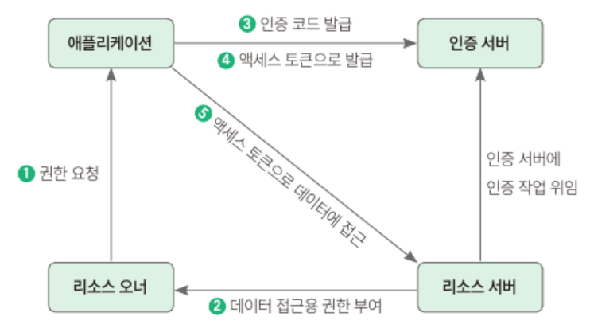
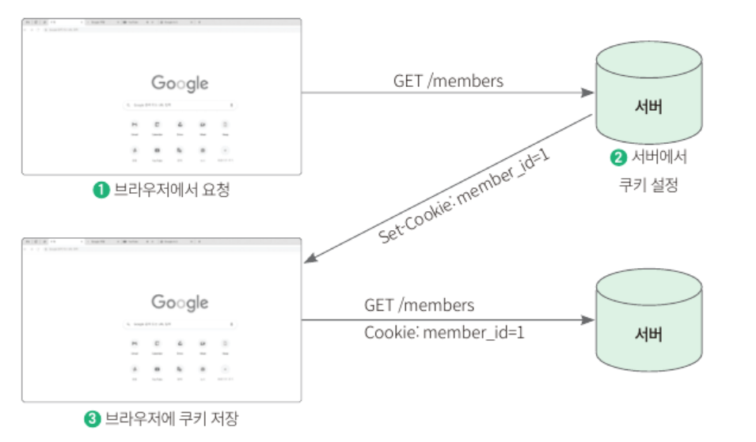

## 10.1 사전 지식: OAuth
### 10.1.1 OAuth란?
- OAuth: 제3의 서비스에 계정 관리를 맡기는 방식
- OAuth 사용 시, 인증 서버에서 발급 받은 토큰을 사용해서 리소스 서버에 리소스 오너의 정보를 요청하고 응답받아 사용 가능하다.
#### OAuth 용어 정리
  - **리소스 오너** (resource owner): 자신의 정보를 사용하도록 인증 서버에 허가하는 주체. 서비스를 이용하는 사용자가 해당된다.
  - **리소스 서버** (resource server): 리소스 오너의 정보를 가지며, 리소스 오너의 정보를 보호하는 주체. 네이버, 구글, 페이스북이 해당된다.
  - **인증 서버** (authorization server): 클라이언트에게 리소스 오너의 정보에 접근할 수 있는 토큰을 발급하는 역할을 하는 애플리케이션
  - **클라이언트 애플리케이션** (client application): 인증 서버에게 인증을 받고 리소스 오너의 리소스를 사용하는 주체. 지금 만들고 있는 서비스가 이에 해당된다.
#### 리소스 오너의 정보를 취득하는 4가지 방법 
  - **권한 부여 코드 승인 타입** (authorization code grant type): OAuth 2.0 에서 가장 잘 알려진 인증 방법으로, 클라이언트가 리소스에 접근하는 데 사용하며, 권한에 접근할 수 있는 코드와 리소스 오너에 대한 액세스 토큰을 발급받는 방식. 사용자 데이터가 외부로 전송되지 않아 안전하다.
  - **암시적 승인 타입** (implicit grant type): 서버가 없는 자바 스크립트 웹 애플리케이션 클라이언트에서 주로 사용하는 방법. 클라이언트가 요청을 보내면 리소스 오너의 인증 과정 이외에는 권한 코드 교환 등의 별다른 인증 과정을 거치지 않고 액세스 토큰을 제공받는 방식
  - **리소스 소유자 암호 자격증명 승인 타입** (resource owner password credentials): 클라이언트의 패스워드를 이용해서 액세스 토큰에 대한 사용자의 자격 증명을 교환하는 방식
  - **클라이언트 자격증명 승인 타입** (client credentials grant): 클라이언트가 컨텍스트 외부에서 액세스 토큰을 얻어 특정 리소스에 접근을 요청할 때 사용하는 방식

### 10.1.2 권한 부여 코드 승인 타입이란?
- 인증 순서


#### 권한 요청이란?
- 권한 요청: 클라이언트, 즉, 스프링 부트 서버가 특정 사용자 데이터에 접근하기 위해 권한 서버, 즉 카카오나 구글 권한 서버에 요청을 보내는 것
- 보통 클라이언트 ID, 리다이렉트 URI, 응답 타입 등을 파라미터로 보낸다. 
- 권한 요청을 위한 파라미터 예시
    ```
    GET spring-authorization-server.example/authorize?
        client_id=66a36b4c2&
        redirect_uri=http://localhost:8080/myapp&
        response_type=code&
        scope=profile
    ```
    - client_id: 인증 서버가 클라이언트에 할당한 고유 식별자. 클라이언트 애플리케이션을 OAuth 서비스에 등록할 때 서비스에서 생성하는 값
    - redirect_url: 로그인 성공시 이동해야하는 URI
    - response_type: 클라이언트가 제공받길 원하는 응답 타입. 인증 코드를 받을 때는 code값을 포함해야한다.
    - scope: 제공받고자 하는 리소스 오너의 정보 목록
#### 데이터 접근용 권한 부여
- 인증 서버에 요청을 처음 보내는 경우 사용자의 데이터에 접근 동의를 얻는 과정을 거치며, 이후에는 인증 서버에서 동의 내용을 저장하고 있기 때문에 로그인만 진행된다. 
- 로그인이 성공될 시 권한 부여 서버는 데이터에 접근할 수 있도록 인증 및 권한 부여를 수신한다.
#### 인증 코드 제공
- 사용자가 로그인에 성공하면 권한 요청 시 파라미터로 보낸 redirect_uri 로 리다이렉션된다. 
- 이때 파라미터에 인증 코드를 함께 제공한다.
    ```
  GET http://localhost:8080/myapp?code=a1s2fmcj2
  ```
#### 액세스 토큰 응답이란?
- 액세스 토큰: 로그인 세션에 대한 보안 자격을 증명하는 식별 코드
- 인증 코드를 받으면 액세스 토큰으로 교환한다.
- /token POST 요청은 다음과 같이 보낸다.
    ```
    POST spring-authorization-server.example.com/token
    {
        "client-id": "66a364c2",
        "client_secret": "aabb11dd44",
        "redirect_uri": "http://localhost:8080/myapp",
        "grant_type": "authorization_code",
        "code": "aa1b2c3d4e5f6g7h8"
    }
    ```
  - client_secret: OAuth 서비스에 등록할 때 제공받는 비밀키
  - grant_type: 권한 유형을 확인하는 데 사용한다. 권한 서버는 요청 값을 기반으로 유효한 정보인지 확인하고, 유효한 정보라면 액세스 토큰으로 응답한다.
    ```json
    {
        "access_token": "aasdffb",
        "token_type": "Bearer",
        "expires_in": 3600,
        "scope": "openid profile",
    ...생략
    }
    ```
#### 액세스 토큰으로 API 응답 & 반환
- 제공받은 액세스 토큰을 통해 리소스 오너의 정보를 가져올 수 있다. 정보가 필요할 때마다 API 호출을 통해 정보를 가져오며 리소스 서버는 토큰이 유효한지 검사 후 응답한다.
- 리소스 오너의 정보를 가져오기 위한 요청 예시
    ```
    GET spring-authorization-resource-server.example/userinfo
    Header: Authorzation: Bearer aasdffb
    ```

### 10.1.3 쿠키란?
- 쿠키: 사용자가 어떤 웹사이트를 방문했을 때 해당 웹사이트의 서버에서 사용자의 로컬 환경에 저장하는 작은 데이터. 키와 값으로 이루어져 있다. 
- HTTP 요청을 통해 쿠키의 특정 키에 값을 추가할 수 있으며, 아래와 같은 과정으로 추가된다.
    

## 10.2 토큰 발급받기
#### 1단계: 구글 클라우드 콘솔로 이동
#### 2단계: 프로젝트 생성 
#### 3단계: 좌측 햄버거 메뉴에서 API 및 서비스 → 사용자 인증 정보 버튼을 눌러 페이지 이동
#### 4단계: 사용자 인증 정보 페이지에서 동의 화면 구성 버튼 클릭 후 User Type을 외부용으로 선택해 동의 화면 구성 마치기
#### 5단계: 앱 정보 입력 (앱 이름, 사용자 지정 이메일, 개발자 연락처)
#### 6단계: 범위 설정 화면에서 범위 추가 또는 삭제 버튼을 누른 후 openid, 이메일 주소를 추가 후 업데이트 버튼 클릭
#### 7단계: 테스트 사용자는 추가 X 다 만들었으면 대시보드로 돌아가기
#### 8단계: 사용자 인증 정보 → 사용자 인증 정보 만들기 → OAuth 클라이언트 ID 를 순서대로 클릭
#### 9단계: 애플리케이션 유형, 이름, 승인된 리다이렉션 URI 를 입력 후 나오는 클라이언트 ID와 클라이언트 보안 비밀번호 메모
#### 10단계: 앞서 메모한 ID와 비밀번호를 application.yml 에 추가 (외부에 노출 X)

## 10.3 스프링 시큐리티로 OAuth2 를 구현하고 적용하기
### 10.3.1 의존성 추가
### 10.3.2 쿠키 관리 클래스 구현
- util/CookieUtil.java
  - addCookie: 요청값 (이름, 값, 만료 기간)을 바탕으로 HTTP 응답에 쿠키를 추가
  - deleteCookie: 쿠키 이름을 입력받아 쿠키를 삭제. 실제로 삭제하는 방법은 없으므로 파라미터로 넘어온 키의 쿠키를 빈 값으로 바꾸고 만료 시간을 0으로 설정해준다.
  - serialize: 객체를 직렬화해 쿠키의 값으로 들어갈 값으로 변환
  - deserialize: 쿠키를 역직렬화해 객체로 변환
### 10.3.3 OAuth2 서비스 구현하기
- 사용자 정보를 조회해 이미 테이블에 존재하는 사용자라면 리소스 서버에서 제공해주는 이름을 업데이트하고, 존재하지 않는다면 새 사용자를 생성해 데이터베이스에 저장하는 서비스 구현
#### 1단계: domain/User.java 에서 사용자 이름과 OAuth 관련 키를 저장하는 코드 추가
#### 2단계: config/oauth/OAuth2UserCustomService.java 에서 loadUser()를 통해 사용자를 조회하고, 앞선 로직을 구현
- loadUser(): 부모 클래스의 메서드인 OAuth 서비스에서 제공하는 정보를 기반으로 유저 객체를 만들어주는 loadUser()를 사용해서 사용자 객체를 불러온다.
- saveOrUpdate(): 사용자가 user 테이블에 있으면 업데이트, 없으면 새로 생성해서 데이터베이스에 저장
### 10.3.4 OAuth2 설정 파일 작성
#### 1단계: 기존 WebSecurityConfig.java 내용 모두 주석처리
#### 2단계: config/WebOAuthSecurityConfig.java 생성 후 코드 작성
- filterChain(): 토큰 방식으로 인증하므로 기존의 폼 로그인과 세션 기능 비활성화
- addFilterBefore(): 헤더값을 확인할 커스텀 필터 추가
- authorizeRequests(): 토큰 재발급 URL은 인증 없이 접근하도록 설정하고 나머지 API는 모두 인증 후 접근 가능하도록 설정
- oauth2Login() 메서드 이후 체인 메서드 수정: OAuth2에 필요한 정보를 세션이 아닌 쿠키에 저장해서 쓸 수 있도록 인증 요청과 관련된 상태를 저장할 저장소 설정, 인증 성공시 실행할 핸들러 설정
- exceptionHandling() 메서드 예외 처리 설정: /api로 시작하는 url인 경우 인증 실패시 401 상태 코드 리턴하도록 설정
#### 3단계: config/oauth/OAuth2AuthorizationRequestBasedOnCookieRepository.java 인증 요청과 관련된 상태를 저장할 저장소 구현 
#### 4단계: config/oauth/OAuth2SuccessHandler.java 인증 성공 시 실행할 핸들러 구현

### 10.3.5 글에 글쓴이 추가하기
- domain 패키지의 Article.java 에 author 변수 추가 및 빌더 패턴에서도 author 추가
- AddArticleRequest.java 의 toEntity() 메서드 수정해서 author 값도 추가 저장하도록 변경
- BlogService.java 의 save() 메서드에서 유저 이름을 추가로 입력 받아 toEntity()의 인수로 전달하도록 수정
- BlogApiContoller.java 에서 principal 객체를 파라미터로 추가해 인증 객체에서 유저 이름을 가져온 후 save() 메서드로 넘겨주도록 수정
- ArticleViewResponse.java 에서 article 필드 추가
- data.sql 에 author 컬럼을 추가하도록 데이터 수정
- article.html 에서 글쓴이의 정보를 알 수 있도록 뷰 수정

### 10.3.6 OAuth 뷰 구성하기
- 로그인 화면에서 사용할 이미지를 구글 로그인 브랜드 페이지에서 다운로드

### 10.4 OAuth2 실행 테스트하기
- 구글 로그인 후 로컬 스토리지에서 액세스 토큰이 저장된 것 확인
- 구글 로그인 후 쿠키에서 리프레시 토큰이 저장된 것 확인
