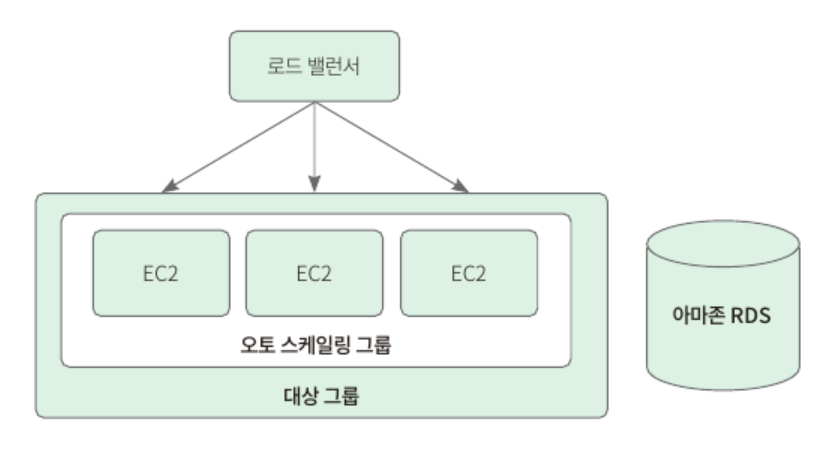
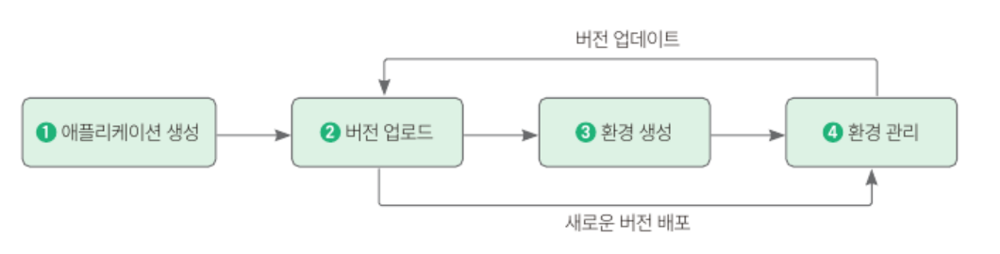

## 11.1 사전지식 : AWS
### 11.1.1 AWS란?
- 배포 : 다른 PC에서 서비스에 접속할 수 있도록 실제 서버에 스프링 부트 서버를 올려 실행하는 것
  - 서버용 PC를 구매해서 배포하는 방법 (물리적 서버) 과 AWS와 같은 클라우드 컴퓨팅 서비스 (클라우드 서버) 를 이용해 배포하는 방법 존재
  - 물리적 서버 : 서버 관리를 직접 할 수 있기 때문에 보안적으로 유리하지만 서버가 크면 따로 서버실을 만들어야 할 정도로 공간의 제약 ↑ 서버의 리소스가 부족할 때에는 직접 서버를 추가 구매해야하기 때문에 시간 소요 ↑
  - 클라우드 서버 : 가상의 공간에서 서버를 제공받기 때문에 공간의 제약 X 서버를 추가하거나 줄이고 싶을 때 원하는 만큼 바로 조절 가능. 그러나 클라우드 서비스 자체에 문제가 생길 시 대처가 어렵
### 11.1.2 AWS 서비스로 우리의 서비스 배포하기
- 배포를 위해 사용할 서비스
  - EC2 : AWS 에서 제공하는 원격 서버
    - 오토 스케일링 그룹
    - 타깃 그룹
    - 로드 밸런서
  - RDS : AWS 에서 제공하는 원격 데이터베이스

#### 가상의 PC 또는 서버 EC2
AWS 에서 제공하는 클라우드 컴퓨팅 서비스로 가상의 PC 즉, 서버 한 대를 임대하는 서비스
#### 유동적으로 EC2를 관리해주는 오토 스케일링 그룹
사용자의 요청 횟수에 따라 EC2를 늘이거나 줄인다.
#### 요청을 분산시켜주는 로드 밸런서
로드밸런서 : 요청들이 한 경로로 들어오지 않도록 요청들을 분산시켜주는 역할       
대상 그룹 : 로드 밸런서를 만들 때 요청을 어디로 분산시킬지 그룹을 정하는데, 이러한 그룹을 이른다.
#### 데이터 저장소 RDS
AWS에서 제공하는 클라우드 데이터베이스 서비스 중 하나로 범용 데이터베이스인 아마존 관계형 데이터베이스

### 11.1.3 설정이 간편한 일래스틱 빈스토크
- 일래스틱 빈스토크 : 앞서 언급한 서비스를 한 번에 설정하는 서비스
  - 사용 시 서버 업로드용 코드만 작성해도 서버를 쉽게 올릴 수 있고, 그 외의 기능들 (로드 밸런싱, 오토 스케일링, 모니터링, 배포)을 일래스틱 빈스토크 메뉴 안에 직접 구성하거나 설정 파일로 자동 처리할 수 있다.
  - 추가 비용 없이 애플리케이션을 저장 및 실행하는 데 필요한 AWS 리소스에 대해서만 요금을 지불하면 된다.
#### 일래스틱 빈스토크를 사용하는 과정

1. 애플리케이션 생성
2. 애플리케이션의 소스를 번들 형태 (Java.war) 로 버전을 일래스톡 빈스토크에 업로드
3. 일래스틱 빈스토크가 자동으로 환경을 실행하고, 코드 실행에 필요한 AWS 리소스 생성 및 구성
4. 환경 실행 후에는 환경을 직접 관리하고 필요한 경우 버전 업데이트나 새로운 앱 버전 배포 진행

## 11.2 AWS 계정 생성하기
- AWS 는 계정 생성 후 1년동안 프리티어 자격 제공 
- 프리티어 : 서비스 별로 지정된 한도 내에서 무료로 AWS 서비스를 사용할 수 있는 혜택

## 11.3 일래스틱 빈스 토크로 서버 구축하기
### 11.3.1 일래스틱 빈스토크 서비스 생성하기
1. AWS 로그인 후 우리가 만들 서버의 제공 위치 지정 - 살고있는 위치에서 가까울수록 응답 속도가 빠르다.
2. 일래스틱 빈스토크 서비스로 들어가 [Create Application] 버튼으로 서비스 생성
3. 애플리케이션 이름 입력, 플랫폼으로 Java Corretto 17 선택, 애플리케이션 코드는 '샘플 애플리케이션' 선택
4. [환경] 을 눌러 일래스틱 빈스토크 환경 목록을 보고, 방금 생성한 환경의 상태가 OK로 보이는지와 URL에 잘 접속되는지 확인

### 11.3.2 일래스틱 빈스토크에서 RDS 생성하기
1. 일래스틱 빈스토크 환경에서 [구성] 을 눌러 환경 설정 메뉴에 들어간 후 데이터베이스 메뉴 편집
2. 사용할 데이터베이스 엔진은 mysql, 용량은 프리티어를 지원하는 db t2.micro 선택, 사용자 이름과 암호를 채운 후 생성
3. 생성되는 것을 기다리고 [구성] 메뉴에서 생성된 데이터베이스를 확인
4. [구성] 메뉴에서 [편집] 을 선택해 데이터베이스의 정보를 (엔드포인트, 사용자 이름, 비밀번호) 입력한 후 [적용] 버튼을 눌러 마무리
5. application.yml 에서 spring.datasource 항목 삭제 - 애플리케이션 실행 시 일래스틱 빈스토크에서 값을 덮어쓰기 때문

### 11.3.3 로컬에서 RDS 연결하기
1. 일래스틱 빈스토크 [구성] 에서 데이터베이스 영역의 엔드포인트를 눌러 데이터베이스 관리 페이지로 이동
2. DB 식별자 링크를 눌러 이동한 후 [연결&보안] 탭의 보안 그룹에 있는 VPC 보안 그룹 하이퍼 링크 클릭
3. 인바운드 규칙 탭을 눌러 이동한 후 [인바운드 규칙 편집] 버튼 클릭
4. 기본값 수정 - 유형은 MYSQL/Aurora, 소스는 내 IP 를 선택 후 저장 - 로컬에서 일래스틱 빈스토크 데이터베이스에 접근할 수 있게 된다.
5. 인텔리제이에서 database navigator 플러그인 (by Dan Cioca) 설치 후 재시작, 왼쪽 도구 메뉴에서 DB Browser 선택 후 [+] 버튼을 눌러 Data source → MYSQL 선택
6. 데이터베이스 정보 창에 Host (엔드포인트), Port (3306), Password 입력 후 연결 테스트 
7. [New SQL Console] 을 눌러 테이블을 생성하는 SQL문 작성
8. build.gradle 에 mysql 의존성 추가 

## 11.4 일래스틱 빈스토크에 우리의 서비스 배포하기
### 11.4.1 애플리케이션 배포하기
1. 인텔리제이의 Gradle 탭을 누른 다음 [Tasks → build → build] 를 더블클릭해 빌드 진행
2. 빌드가 끝나면 build → libs 경로에 빌드 완성 파일 (jar) 이 생성된다.
3. 일래스틱 빈스토크로 돌아가 생성된 환경의 이름을 선택 후 [업로드 및 배포] 를 누른 다음 [파일 선택] 버튼을 눌러 jar 파일 선택
4. [구성] 으로 들어가 소프트웨어에서 [편집] 선택 - 애플리케이션을 실행하기 위한 하위 포트 값과 공개 사이트에 올리면 안 되는 민감한 정보를 추가 (설정 시 application.yml 에서 설정한 값들을 덮어쓴다.)
    - 설정해야하는 항목들 : SERVER_PORT (5000) / JWT_SECRET_KEY (study-springboot) / SPRING_SECURITY_OAUTH2_CLIENT_REGISTRATION_GOOGLE_CLIENT_ID (구글 OAuth2에서 발급받은 클라이언트 아이디) / SPRING_SECURITY_OAUTH2_CLIENT_REGISTRATION_GOOGLE_CLIENT_SECRET (구글 OAuth2 에서 발급받은 클라이언트 비밀키) / SPRING_SECURITY_OAUTH2_CLIENT_REGISTRATION_GOOGLE_SCOPE (email.profile)
5. 값 추가 후 확인 버튼을 눌러 환경 업데이트 한 다음 일래스틱 빈스토크에서 제공하는 서버의 URL에 /login 을 붙인 경로로 접속해 제대로 접속되는지 확인 

### 11.4.2 OAuth 서비스에 승인된 URI 추가하기
1. 구글 클라우드 콘솔에 접속해 [API 및 서비스 → 사용자 인증 정보 → OAuth 2.0 클라이언트 ID] 에 추가되어 있는 클라이언트 ID 클릭한 다음 [OAuth 클라이언트 수정 → 승인된 리다이렉션 URI] 에 일래스틱 빈스토크에서 띄워준 서버의 URL 추가 - 승인된 리다이렉션 URI에는 /login/oauth2/code/google 을 붙여주어야 한다.
2. 적용까지 걸리는 시간을 기다린 후 /login 페이지에서 로그인 시도하여 구글 로그인이 잘 되는지 확인
