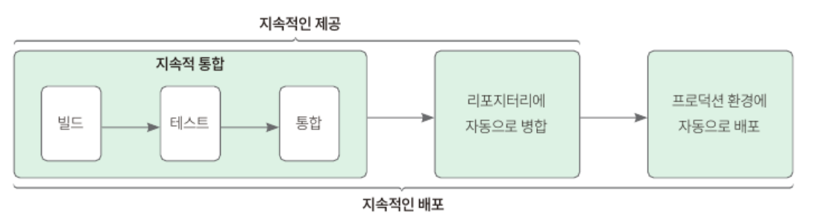

## 12.1 사전 지식: CI/CD
### 12.1.1 CI/CD란?
- CI/CD의 필요성
  - 서비스를 배포하고 운용하는 중에 코드를 변경할 경우 코드 수정 → 로컬 테스트 → 빌드 → jar 파일 생성 및 복사 → AWS에 jar 파일 업로드의 과정을 매번 거치는 것은 불편함
  - CI/CD는 어떤 도구가 아닌 방법으로, 빌드부터 배포까지의 과정을 자동화하고 모니터링할 수 있음
  - CI는 지속적 통합, CD는 지속적 제공을 의미
#### 지속적 통합, CI (Continuous Integration)
- 빌드와 테스트를 자동화하는 과정
- CI는 변경 사항을 자동으로 테스트해 애플리케이션에 문제가 없다는 것을 보장
- 보통 코드 변경 사항이 코드 저장소에 업로드되면 CI를 시작하고, CI 도중 문제가 생기면 실패하므로 코드의 오류도 쉽게 파악 가능
#### 지속적 제공과 지속적 배포, CD
- 배포 준비가 된 코드를 자동으로 서버에 배포하는 작업을 자동화하는 과정
- 지속적 제공에서의 CD 의미
  - 애플리케이션에 적용한 코드의 빌드와 테스트를 성공적으로 진행했을 때 깃허브와 같은 코드 저장소에 자동으로 업로드하는 과정
  - 최소의 노력으로 코드 배포를 쉽게 하는 것을 목표로 함
- 지속적 배포에서의 CD 의미
  - 지속적 제공을 통해 성공적으로 병합한 코드 내역을 AWS와 같은 배포 환경으로 보내는 것 (릴리스)
  - 지속적인 배포는 지속적 제공의 다음 단계까지 자동화

### 12.1.2 깃과 깃허브
- 깃(git): 코드를 저장하고 관리할 수 있는 시스템
- 깃허브(github): 깃과 연동해 작업한 코드를 저장할 수 있는 서비스
- 깃 설치 및 연동 과정
  - 버전 출력: `git --version`
  - 깃 초기 설정: `git config`
  - SSH 키 생성 명령어: `ssh-keygen -t rsa -C "[깃허브 이메일 주소]"`
## 12.2 깃허브 액션 사용하기
- 깃허브 액션: 깃허브에서 제공하는 서비스로, 리포지토리에 특정 이벤트가 발생하면 특정 작업을 하거나 주기적으로 특정 작업을 반복할 수 있게 한다.
### 12.2.1 깃허브 리포지터리 생성하고 코드 푸시하기
- `git init`
  - 특정 폴더를 깃 저장소로 만들 때 사용
  - 숨김 폴더로 .git 폴더가 생김 → 코드의 변경 내역(버전) 관리를 위한 정보를 저장
- `git remote add origin {리포지터리 주소}`
  - 깃허브의 리포지토리와 로컬의 깃 저장소를 연결
- `git add .`: 현재 프로젝트 폴더의 모든 파일을 대상으로 변경 사항 등을 추적하고 그 파일들을 스테이지에 올림
- 스테이지: 리포지터리에 올리기 전 파일들의 변경 사항을 미리 모아놓는 곳
### 12.2.2 깃허브 액션 스크립트 작성하기, CI
  ```yaml
  # 워크플로의 이름 지정
  name: CI
  
  # 워크플로가 시작될 조건 지정 : main 브랜치에 푸시할 때마다 워크플로를 시작하도록 작성
  on:
    push:
      branches: [main]
      
  jobs:
    build:
      runs-on: ubuntu-latest #실행 환경 지정
      steps:
        - uses: actions/checkout@v3
          
        - uses: actions/setup-java@v3
          with:
            distribution: 'zulu'
            java-version: '17'
          
        - name: Grant execute permission for gradlew
          run: chmod +x gradlew
          
        - name: Build with Gradle
          run: ./gradlew clean build
  ```
- 실행 스텝 그룹화 정리
  - uses: 지정한 리포지토리를 확인하고 코드에 대한 작업을 실행할 수 있다. 
  - name: 스텝의 이름 지정
  - run: 실행할 명령어 입력. ./gradlew clean build 는 그레들을 사용해 프로젝트를 빌드 이전 상태로 돌리고 다시 빌드하는 명령어를 실행
- 깃허브에서 워크플로우가 실행되는 것 확인
### 12.2.3 깃허브 액션 스크립트 작성하기, CD
- 현재 프로젝트에서 빌드를 진행하면 일반 jar 파일과 plain 이라는 접미사가 붙은 jar 파일이 생성된다. 
- 플레인 아카이브(plain archive): 애플리케이션 실행에 필요한 의존성을 포함하지 않고 소스 코드의 클래스 파일과 리소스 파일만 포함
- 일반 jar 파일만 생성하도록 gradle 파일 변경
  ```
  jar{
    enabled = false
  }
  ```
- 깃허브 액션 스크립트 작성
  ```yaml
  # 워크플로의 이름 지정
  name: CI/CD
  
  # 워크플로가 시작될 조건 지정 : main 브랜치에 푸시할 때마다 워크플로를 시작하도록 작성
  on:
    push:
      branches: [main]
  
  jobs:
    build:
      runs-on: ubuntu-latest #실행 환경 지정
      steps:
        - uses: actions/checkout@v3
  
        - uses: actions/setup-java@v3
          with:
            distribution: 'corretto'
            java-version: '17'
  
        - name: Grant execute permission for gradlew
          run: chmod +x gradlew
  
        - name: Build with Gradle
          run: ./gradlew clean build
  
        #현재 시간 가져오기 (플러그인 사용)
        - name: Get current time
          uses: josStorer/get-current-time@v2.0.2
          id: current-time
          with:
            format: YYYY-MM-DDTHH-mm-ss
            utcOffset: "+09:00"
  
        # 배포용 패키지 경로 저장 (빌드 이후에 생성된 jar 파일을 찾아 "artifact"라는 환경 변수에 값을 넣어준다.
        - name: Set artifact
          run: echo "artifact=$(ls ./build/libs)" >> $GITHUB_ENV
  
        # 빈스토크 배포 (플러그인을 사용)
        - name: Beanstalk Deploy
          uses: einaregilsson/beanstalk-deploy@v20
          with:
            aws_access_key: ${{ secrets.AWS_ACCESS_KEY_ID }}
            aws_secret_key: ${{ secrets.AWS_SECRET_ACCESS_KEY }}
            application_name: springboot-developer
            environment_name: springboot-developer-env
            version_label: github-action-${{steps.current-time.outputs.formattedTime}}
            region: ap-northeast-2
            deployment_package: ./build/libs/${{env.artifact}}
  ```
- AWS에서 IAM 사용자 액세스 키 생성 후 깃허브 Secrets and Variables 설정